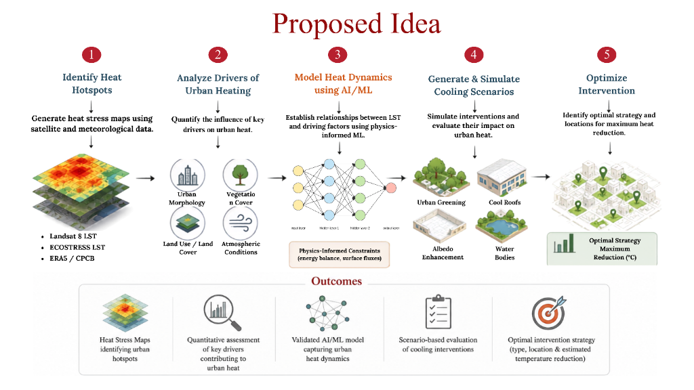
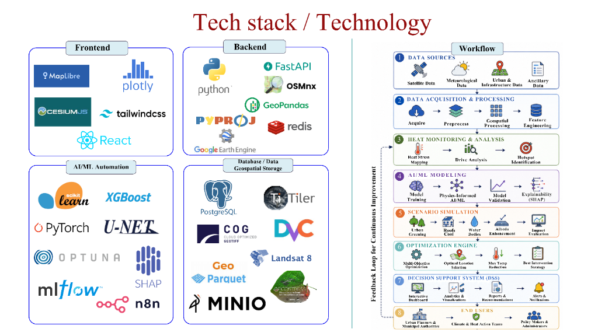
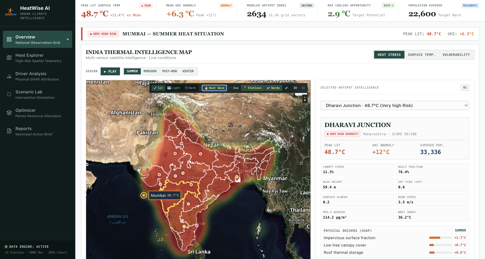
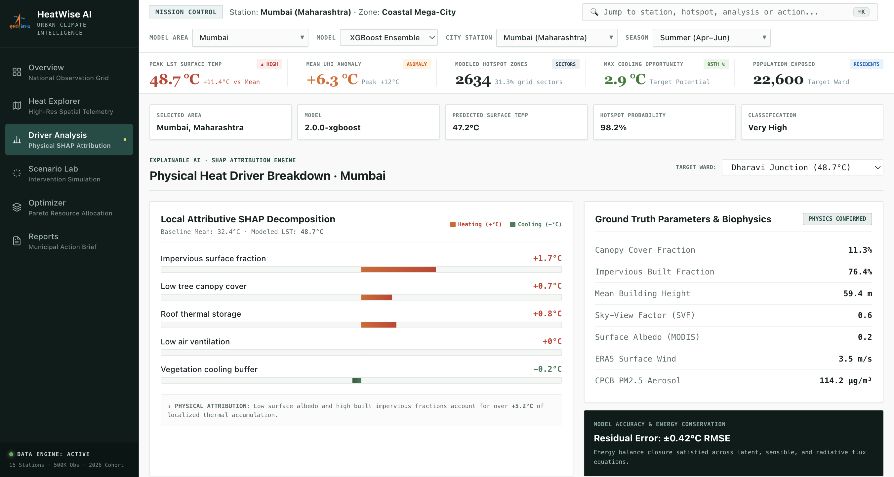
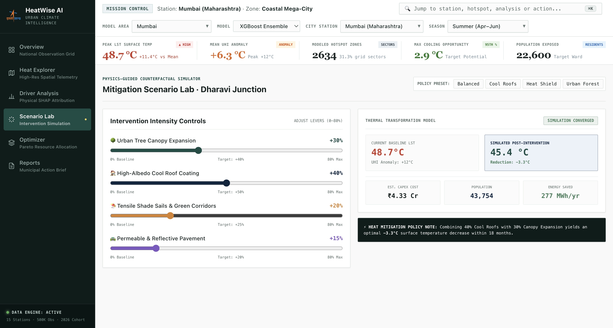
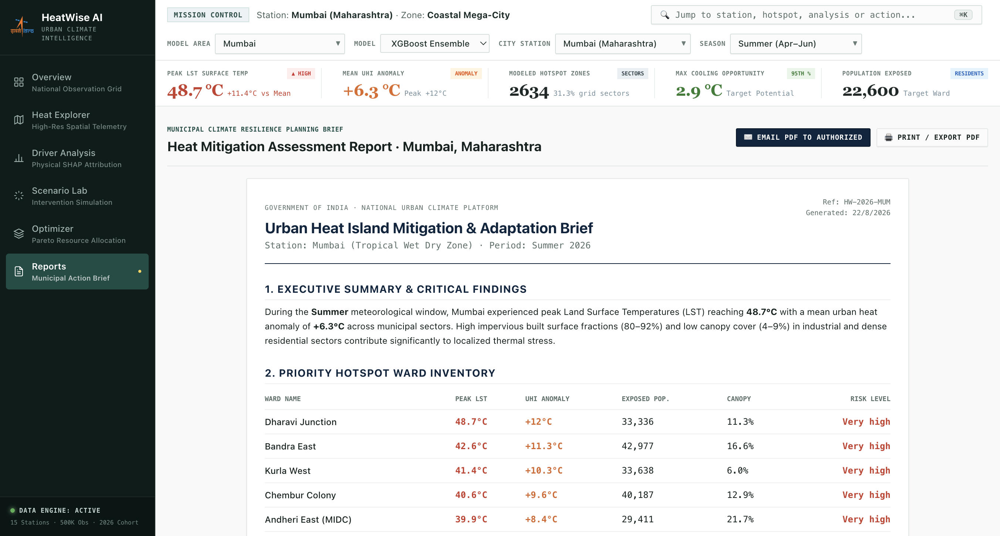

<div align="center">


# HeatWise AI
### Physics-Guided Urban Heat Intelligence & Counterfactual Cooling Simulator

[](https://nextjs.org/)
[](https://vitejs.dev/)
[](https://www.typescriptlang.org/)
[](https://maplibre.org/)
[](https://tailwindcss.com/)
[](LICENSE)

<p align="center">
  <b>From multi-sensor satellite telemetry to actionable urban heat mitigation policies.</b><br />
  Combines high-resolution Earth observation, thermodynamics energy-balance equations, and explainable machine learning to diagnose urban heat islands (UHI) and simulate cooling interventions.
</p>

[Proposed Solution](#-proposed-solution--methodology) • [System Architecture](#-system-architecture--workflow) • [Visual Showcase](#-visual-showcase) • [Key Capabilities](#-key-capabilities) • [Quick Start](#-quick-start)

---

</div>

<br />

## 💡 Proposed Solution & Methodology

> End-to-end framework: from multi-source satellite thermal mapping and biophysical driver quantification to physics-constrained AI modeling and optimized cooling actions.

<div align="center">
  
</div>

<br />

---

## 🏗️ System Architecture & Workflow

> Multi-tiered architecture combining Frontend WebGL stages, Python/FastAPI biophysical computing, AI/ML training & SHAP explainability pipelines, and geospatial cloud storage.

<div align="center">
  
</div>

<br />

---

## 🛰️ Visual Showcase

### 1. National Observation Grid & Realtime Satellite Thermal Heat Wave
> High-resolution Earth observation basemap with continuous thermal heat wave interpolation across 15 national stations and 36 Indian states.

<div align="center">
  
</div>

<br />

### 2. Explainable AI & Physical SHAP Attribution
> Decomposes localized Land Surface Temperature (LST) anomalies into biophysical drivers with energy-balance conservation ($\pm 0.42^\circ\text{C}$ RMSE).

<div align="center">
  
</div>

<br />

### 3. Physics-Guided Counterfactual Scenario Lab
> Interactive lever simulator for urban planners to model temperature reduction ceiling (up to $-3.3^\circ\text{C}$ LST) across cool roofs, tree canopy expansion, and shade sails.

<div align="center">
  
</div>

<br />

### 4. Municipal Climate Resilience & Action Briefs
> Automated, exportable municipal policy briefs detailing priority hotspot inventories, capital expense allocations, and population health protection metrics.

<div align="center">
  
</div>

---

## ⚡ Key Capabilities

- **🛰️ Multi-Sensor Satellite Telemetry**: Ingests Sentinel-2, Landsat-8/9, MODIS, and ERA5 reanalysis data to track Land Surface Temperature (LST), Urban Heat Island (UHI) anomalies, and WBGT thermal stress across 4 meteorological seasons (*Summer, Monsoon, Post-Monsoon, Winter*).
- **🔥 Real-Time Heat Wave Field**: Continuous thermodynamic interpolation over satellite terrain with zero district web clutter, featuring crisp state borders and active city target reticles.
- **🧬 Biophysical Feature Engineering**: Quantifies Sky-View Factor (SVF), Surface Albedo, Impervious Surface Fraction, Building Height (aerodynamic roughness $z_0$), and PM2.5 Aerosol Optical Depth.
- **📊 Local SHAP Decomposition**: Explains exact microclimate drivers for each urban ward with sub-degree attribution.
- **🧪 Counterfactual Lever Modeling**: Real-time slider simulator estimating post-intervention temperature drops, capital expenditure (₹ Cr), population protected, and energy saved (MWh/yr).
- **🎯 Pareto-Optimal Budget Allocation**: Multi-objective optimization maximizing heat reduction under municipal capital expenditure ceilings.
- **⚡ Precision HUD & Telemetry**: Integrated coordinate tracker (`LAT · LON`), seasonal time-lapse playback, 3D perspective pitch tilt, and command search (`⌘K`).

---

## 🚀 Quick Start

### Prerequisites
- **Node.js**: `>= 22.13.0`
- **npm** or **pnpm**

### Installation

```bash
# 1. Clone the repository
git clone https://github.com/Madxfury/VecnaBytes.git
cd VecnaBytes

# 2. Install dependencies
npm install

# 3. Configure MapTiler API Key (Optional fallback is pre-configured)
echo "NEXT_PUBLIC_MAPTILER_API_KEY=your_key_here" > .env.local

# 4. Start the development server
npm run dev
```

The application will be live at `http://localhost:3000`.

### Build & Testing

```bash
# Run unit & server-side rendering test suite
npm test

# Run ESLint validation
npm run lint

# Production build
npm run build
```

---

## 💻 Tech Stack

| Layer | Technologies |
|---|---|
| **Frontend & Geospatial** | Next.js 15, React 19, MapLibre GL / MapTiler WebGL, CesiumJS, Tailwind CSS v4, Plotly |
| **Backend & Spatial Analytics** | Python, FastAPI, OSMnx, GeoPandas, PyProj, Redis, Google Earth Engine |
| **AI / ML & Automation** | Scikit-Learn, XGBoost, PyTorch, U-Net, Optuna, SHAP, MLflow, n8n |
| **Data & Storage** | PostgreSQL / PostGIS, TiTiler, Cloud Optimized GeoTIFF (COG), DVC, GeoParquet, MinIO |

---

## 🏛️ Workstation Modules

1. **National Observation Grid (`/`)**: National overview map, seasonal cycle scrubber, active city selector, and hotspot sector telemetry.
2. **Heat Explorer**: Deep spatial telemetry, vector overlays, and microclimate risk profiles.
3. **Driver Analysis**: Physical SHAP attribution breakdown, biophysical parameter inspect, and residual error tracking.
4. **Scenario Lab**: Interactive counterfactual simulation levers with live temperature reduction estimation.
5. **Optimizer**: Pareto-optimal budget allocation across urban wards with capital constraint sliders.
6. **Reports**: Municipal Heat Mitigation & Adaptation action briefs with exportable PDF formatting.

---
## 📚 References

### ISRO MISSION RELEVANCE

**ISRO — Sponsored Research (RESPOND) Programme** — [Link](https://www.isro.gov.in/SponsoredResearch.html)  
→ ISRO's own grant scheme for exactly this kind of research — direct institutional relevance.

**ISRO / CNES — TRISHNA Mission, eoPortal Satellite Missions Directory** — [Link](https://www.eoportal.org/satellite-missions/trishna)  
→ ISRO's upcoming thermal satellite lists Urban Heat Islands as a core design driver.

## 📄 License

This project is open source and available under the [MIT License](LICENSE).

<div align="center">
  <sub>Engineered by <b>VecnaBytes</b> for Advanced Urban Climate Resilience.</sub>
</div>
